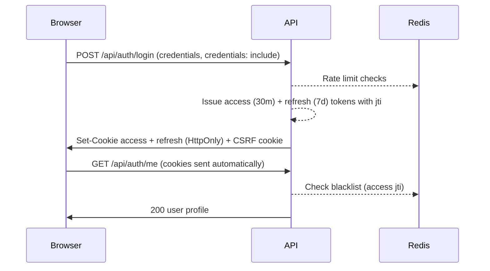
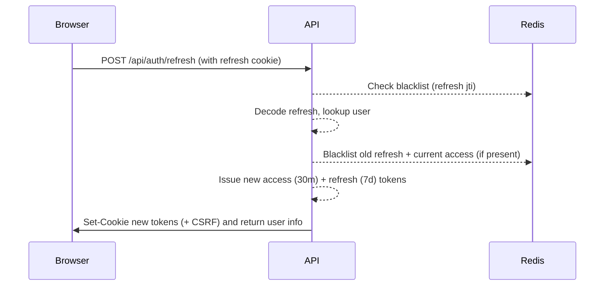
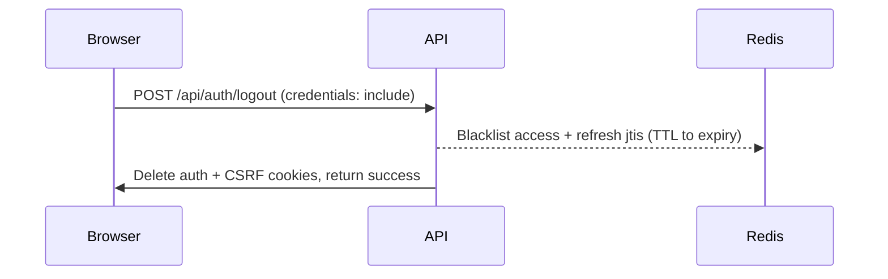

# Authentication & Token Lifecycle

This project uses short-lived access tokens (30 minutes) and rotating refresh tokens (7 days) stored **only** in HttpOnly cookies. Tokens are signed with `SECRET_KEY`, include a unique `jti`, and are blacklisted in Redis when revoked.

## Tokens and Cookies
- `ocean_portal_token`: Access token, 30-minute lifetime, HttpOnly, SameSite=Lax (Strict in production), Secure in HTTPS.
- `ocean_portal_refresh_token`: Refresh token, 7-day lifetime, HttpOnly, SameSite=Lax (Strict in production), Secure in HTTPS.
- CSRF: A separate non-HttpOnly CSRF cookie is set for state-changing requests. The frontend copies it into `X-CSRF-Token`.
- Blacklist: Revoked tokens are stored in Redis as `token:blacklist:{jti}` with TTL equal to the remaining token lifetime. If Redis is unavailable, blacklist checks are skipped but tokens still expire.

## Login Flow


## Refresh Flow


## Logout / Invalidation


## Frontend Expectations
- Authentication state relies solely on cookies; no `localStorage` fallback.
- Axios is configured with `withCredentials: true`; no manual `Authorization` header is required.
- On 401 responses, the app clears in-memory auth state; callers may route users back to `/auth/login`.

## API Endpoints

| Endpoint | Method | Description |
|----------|--------|-------------|
| `/api/auth/login` | POST | Authenticate with username/password, returns user + sets cookies |
| `/api/auth/register` | POST | Create new user account with automatic login |
| `/api/auth/logout` | POST | Invalidate session and blacklist tokens in Redis |
| `/api/auth/refresh` | POST | Refresh access token using refresh token cookie |
| `/api/auth/me` | GET | Get current authenticated user profile |
| `/api/auth/csrf-token` | GET | Get CSRF token for state-changing requests |
| `/api/token` | POST | OAuth2-compatible token endpoint (form-based) |

## Security Features

### Rate Limiting
Authentication endpoints are protected with Redis-backed rate limiting:
- **Login**: 5 attempts/minute per username, 10 attempts/minute per IP
- **Register**: 3 attempts/minute per email, 5 attempts/minute per IP

### Password Requirements
- Minimum 12 characters
- At least one lowercase letter
- At least one uppercase letter
- At least one number
- At least one special character (`!@#$%^&*(),.?":{}|<>`)

### Token Security
- All tokens include a unique `jti` (JWT ID) for blacklist tracking
- Token type (`access` vs `refresh`) is verified on each endpoint
- Blacklisted tokens are rejected even if signature is valid
- Token rotation: old tokens are blacklisted when new ones are issued

## Configuration

Environment variables with defaults:
```env
SECRET_KEY=<required in production>
ALGORITHM=HS256
ACCESS_TOKEN_EXPIRE_MINUTES=30
REFRESH_TOKEN_EXPIRE_MINUTES=10080  # 7 days
```

## Error Responses

| Status | Condition |
|--------|-----------|
| 401 Unauthorized | Invalid/expired token, blacklisted token, or missing credentials |
| 400 Bad Request | Invalid password format during registration |
| 429 Too Many Requests | Rate limit exceeded |
