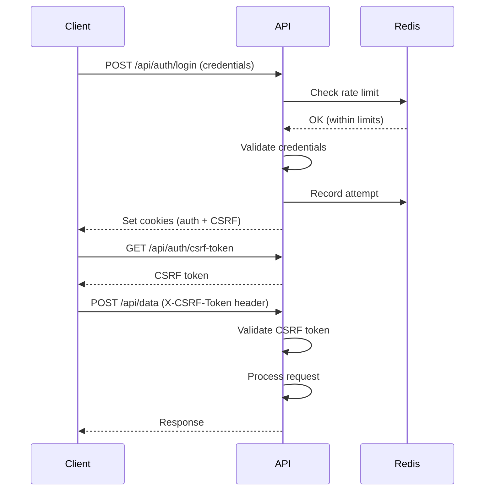

# Security Hardening Implementation

This document describes the security hardening measures implemented in Week 1 of the production readiness plan.

## ✅ Completed Security Enhancements

### 1. Git History Cleanup

**Threat**: Sensitive credentials (SECRET_KEY, database passwords, API keys) were committed to `.env.production` and `.env.production.example` files.

**Solution**: 
- Created `SECURITY_HARDENING.sh` script using `git-filter-repo` to remove files from all git history
- Script includes safety checks and team coordination prompts
- Generates backup branch before destructive operation

**Usage**:
```bash
./SECURITY_HARDENING.sh
```

**Critical**: All team members must re-clone the repository after running this script.

---

### 2. Production Secrets Regeneration

**Threat**: Exposed secrets must be rotated immediately after git history cleanup.

**Solution**:
- Created `scripts/generate_secrets.py` to generate cryptographically secure secrets
- Uses `secrets.token_urlsafe()` for URL-safe randomness
- Generates:
  - SECRET_KEY (64 bytes)
  - POSTGRES_PASSWORD (32 chars)
  - MINIO credentials (32 chars)
  - CSRF_SECRET (32 bytes)
  - VAPID keys (for push notifications)

**Usage**:
```bash
python3 scripts/generate_secrets.py
```

**⚠️ Important**: Store generated secrets in a secrets manager (AWS Secrets Manager, Azure Key Vault, HashiCorp Vault). Never commit to git.

---

### 3. Docker User Security

**Threat**: All Docker containers were running as root (UID 0), violating principle of least privilege.

**Solution**:

**Frontend (Node.js)**:
- Added `USER node` directive to `frontend/Dockerfile`
- Runs as UID 1000 (node user from base image)
- No elevated privileges needed for Next.js dev server

**Backend (Python)**:
- Created `appuser` with UID 1000 in `app/Dockerfile`
- Set ownership of `/app` directory to `appuser:appuser`
- Added `USER appuser` before ENTRYPOINT

**Verification**:
```bash
docker compose exec frontend whoami  # Should output: node
docker compose exec api whoami       # Should output: appuser
```

---

### 4. CSRF Protection

**Threat**: Cookie-based authentication vulnerable to Cross-Site Request Forgery attacks.

**Solution**:
- Implemented double-submit cookie pattern in `app/middleware/csrf_protection.py`
- `CSRFProtection` class with token generation and validation
- Tokens are URL-safe, signed with HMAC-SHA256
- Set CSRF cookie on login/register (httponly=False for JavaScript access)
- Validate tokens on state-changing requests (POST, PUT, DELETE)

**Architecture**:
```
1. Client logs in
2. Server sets two cookies:
   - ocean_portal_token (HttpOnly, auth token)
   - csrf_token (readable by JS)
3. Client reads csrf_token from cookie
4. Client includes csrf_token in X-CSRF-Token header for POST/PUT/DELETE
5. Server validates: header token === cookie token
```

**New Endpoints**:
- `GET /api/auth/csrf-token` - Get CSRF token for frontend
- `POST /api/auth/logout` - Clear auth + CSRF cookies

**Usage in FastAPI**:
```python
from middleware.csrf_protection import get_csrf_protection

@router.post("/sensitive-action", dependencies=[Depends(get_csrf_protection)])
async def sensitive_action():
    # Automatically protected
    pass
```

---

### 5. Redis-Backed Rate Limiting

**Threat**: In-memory rate limiting resets on server restart, allowing attackers to bypass limits.

**Solution**:
- Implemented `RateLimiter` class in `app/middleware/rate_limiter.py`
- Uses Redis sorted sets for persistent rate limit tracking
- Falls back to in-memory storage if Redis unavailable
- Per-endpoint configurable limits

**Rate Limit Configurations**:
```python
RATE_LIMITS = {
    'auth_login': {'window': 900, 'max_attempts': 5},      # 5 per 15 min
    'auth_register': {'window': 3600, 'max_attempts': 3},  # 3 per hour
    'upload': {'window': 3600, 'max_attempts': 10},         # 10 per hour
    'api_general': {'window': 60, 'max_attempts': 100},     # 100 per minute
}
```

**Backend Changes**:
- Updated `app/api/auth.py` to use `RateLimiter` instead of in-memory dict
- Initialization in `app/core/main.py` with Redis client
- Automatic fallback if Redis connection fails

**Verification**:
```bash
# Check Redis keys
docker compose exec redis redis-cli KEYS "rate_limit:*"

# Monitor rate limit hits
docker compose exec redis redis-cli MONITOR | grep rate_limit
```

---

## 🔒 Security Architecture Overview

### Authentication Flow (with CSRF)



### Rate Limiting Storage

**Redis Structure**:
```
Key: rate_limit:login:user@example.com
Type: Sorted Set
Members: [(timestamp1, timestamp1), (timestamp2, timestamp2), ...]
Expiry: 900 seconds (15 minutes)
```

**Memory Fallback**:
```python
{
    'login:user@example.com': [timestamp1, timestamp2, ...],
    'upload:192.168.1.1': [timestamp1, timestamp2, ...]
}
```

---

## 🧪 Testing Security Features

### 1. Test Rate Limiting

```bash
# Test login rate limit (should block after 5 attempts)
for i in {1..10}; do
  curl -X POST http://localhost:8000/api/auth/login \
    -H "Content-Type: application/json" \
    -d '{"username":"test","password":"wrong"}' \
    -w "\nStatus: %{http_code}\n"
  sleep 1
done

# Expected: First 5 get 401, subsequent get 429
```

### 2. Test CSRF Protection

```bash
# Get CSRF token
CSRF_TOKEN=$(curl -c cookies.txt http://localhost:8000/api/auth/csrf-token | jq -r '.csrf_token')

# Request without CSRF token (should fail)
curl -X POST http://localhost:8000/api/sensitive-action \
  -b cookies.txt

# Request with CSRF token (should succeed)
curl -X POST http://localhost:8000/api/sensitive-action \
  -b cookies.txt \
  -H "X-CSRF-Token: $CSRF_TOKEN"
```

### 3. Test Docker User Privileges

```bash
# Should fail (not running as root)
docker compose exec api touch /etc/test-file
docker compose exec frontend npm install -g some-package
```

---

## 📋 Deployment Checklist

### Before Deploying to Production:

- [ ] Run `./SECURITY_HARDENING.sh` to remove sensitive files from git
- [ ] Force push to remote: `git push origin --force --all`
- [ ] Notify team to re-clone repository
- [ ] Run `python3 scripts/generate_secrets.py` and store output securely
- [ ] Update production secrets manager with new credentials
- [ ] Rotate database passwords in production
- [ ] Regenerate MinIO credentials
- [ ] Rebuild Docker images: `docker compose build --no-cache`
- [ ] Verify non-root users: `docker compose exec api whoami`
- [ ] Test rate limiting with production Redis
- [ ] Verify CSRF tokens are set on login
- [ ] Enable HTTPS for secure cookies (`secure=true`)
- [ ] Configure WAF rules for additional protection

---

## 🚨 Incident Response

### If Secrets Are Compromised:

1. **Immediate Actions** (within 1 hour):
   - Revoke all API keys and access tokens
   - Change database passwords
   - Regenerate SECRET_KEY
   - Force logout all users

2. **Investigation** (within 4 hours):
   - Check access logs for suspicious activity
   - Review database audit logs
   - Identify scope of breach

3. **Remediation** (within 24 hours):
   - Deploy new secrets via secure channel
   - Rotate all credentials
   - Notify affected users if data exposed
   - Update security documentation

4. **Post-Incident**:
   - Conduct security audit
   - Update runbooks
   - Schedule penetration test

---

## 📚 References

- [OWASP CSRF Prevention Cheat Sheet](https://cheatsheetseries.owasp.org/cheatsheets/Cross-Site_Request_Forgery_Prevention_Cheat_Sheet.html)
- [OWASP Authentication Cheat Sheet](https://cheatsheetseries.owasp.org/cheatsheets/Authentication_Cheat_Sheet.html)
- [Docker Security Best Practices](https://docs.docker.com/develop/security-best-practices/)
- [Redis Security](https://redis.io/topics/security)

---

## 🔄 Next Steps (Week 2)

1. Implement refresh token flow (30-min access + 7-day refresh)
2. Add session invalidation in Redis
3. Set up centralized logging for security events
4. Configure intrusion detection rules
5. Add API rate limiting at gateway level (Envoy/Kong)
